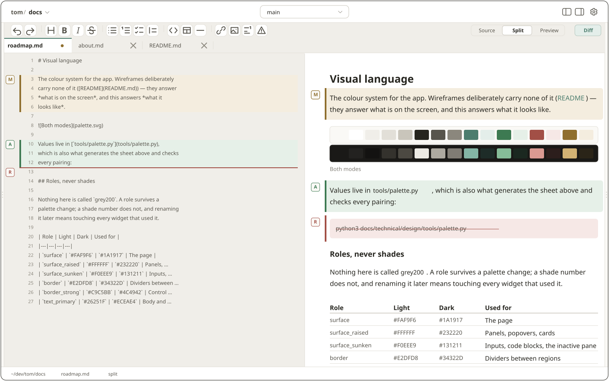
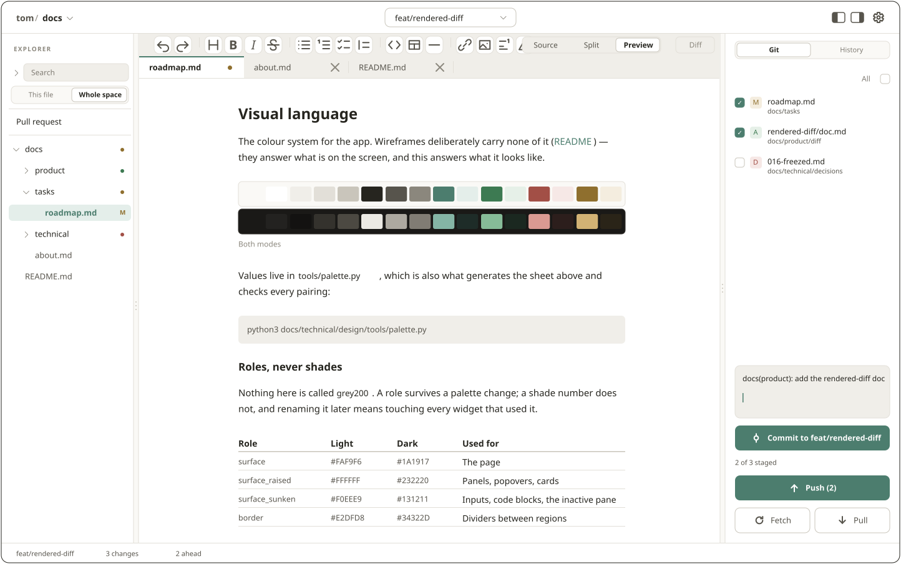
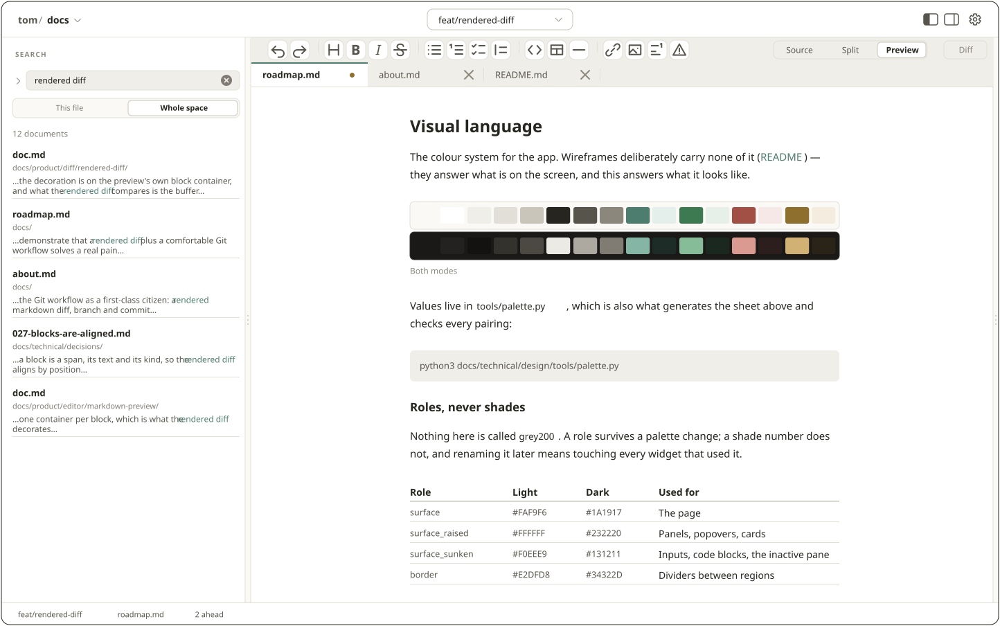
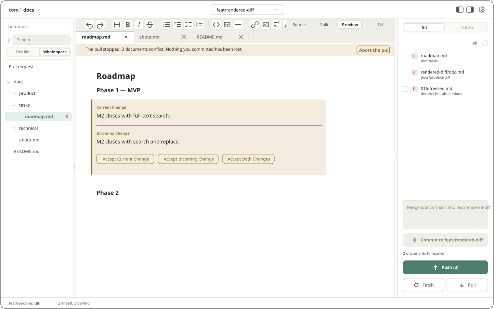
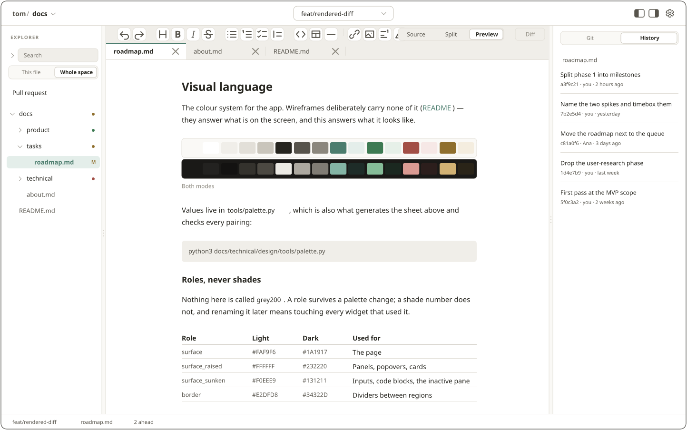
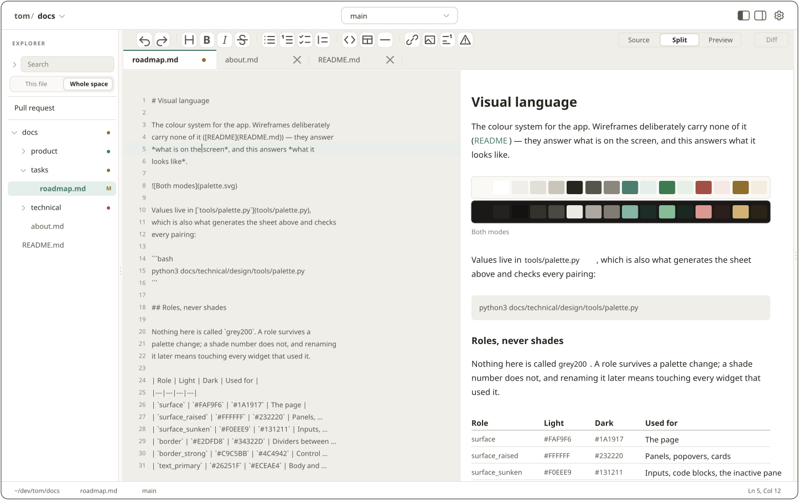

  <picture>
    <source media="(prefers-color-scheme: dark)" srcset="docs/design/brand/tom-lockup-dark.svg">
    
  </picture>

<strong>Team-Oriented Markdown</strong>

A Git client built for documentation, not code.

  
  
  

---

> [!WARNING]
> **The application is not ready.** There is no release, no installer and nothing to download — it does not build on every platform yet. The repository is the work in progress: M0–M2 run from source, M3 is being built ([roadmap](docs/roadmap.md)).

## Screens

**Design boards, not screenshots** — exported from [`docs/design/screens/`](docs/design/screens/README.md), which is what the app is built to, screen by screen, before any widget is written. Light or dark follows your GitHub theme.

### Rendered diff

Changes over the *formatted* document, marks in both panes, against `HEAD` or any branch or commit.

<picture>
  <source media="(prefers-color-scheme: dark)" srcset="docs/design/screens/desktop/git-diff/comparing-dark.svg">
  
</picture>

### Commit, push and pull

Stage, write the message, commit to the branch and publish — one column, no terminal.

<picture>
  <source media="(prefers-color-scheme: dark)" srcset="docs/design/screens/desktop/git-commit/committing-dark.svg">
  
</picture>

### Full-text search

Every document in the space, name · folder · excerpt, with the typed words marked.

<picture>
  <source media="(prefers-color-scheme: dark)" srcset="docs/design/screens/desktop/search/searching-every-document-dark.svg">
  
</picture>

### Conflict resolution

Both sides rendered as markdown — accept current, incoming or both. No `<<<<<<<` reaches a commit.

<picture>
  <source media="(prefers-color-scheme: dark)" srcset="docs/design/screens/desktop/git-conflict/conflict-in-preview-dark.svg">
  
</picture>

### File history

Every commit that touched the open document; open one and read that version.

<picture>
  <source media="(prefers-color-scheme: dark)" srcset="docs/design/screens/desktop/git-history/file-history-dark.svg">
  
</picture>

### Editor

Source and preview, a formatting bar, tabs, and the file tree carrying each document's change mark.

<picture>
  <source media="(prefers-color-scheme: dark)" srcset="docs/design/screens/desktop/workspace/shell-dark.svg">
  
</picture>

## The problem

| Option | Problem |
|---|---|
| Confluence / Notion | Paid, cloud-bound, disconnected from the code, weak versioning |
| Obsidian + Git plugin | Git is a bolted-on add-on; built for personal notes; closed source |
| VS Code + extensions | Hostile to non-developers; no documentation experience |
| MkDocs / Docusaurus | Read-only output; editing still happens in a code editor |

## The bet

Not the editor — **the Git workflow as a first-class citizen**, for documentation.

| | |
|---|---|
| Rendered markdown diff | Changes over the formatted document, not `+/-` on raw text |
| Branching without ceremony | Switch branches and watch the docs change; commit and push in one gesture |
| History and section blame | Who wrote this paragraph, and in which PR |
| Assisted conflict resolution | Both sides rendered side by side |
| A documentation experience | Space navigation, full-text search, wikilinks, images |

Your `.md` files stay plain files on disk. No proprietary format, no mandatory cloud, no account.

## Principles

Files are the truth · Git is the backbone, not a plugin · everything works offline · nothing leaves your machine unless you ask ([Decision 11](docs/technical/decisions/011-telemetry-is-opt-in.md)) · MIT, and whatever is free today stays free. The full list, with the reasoning: [about.md](docs/about.md#principles).

## Documentation

Everything is in [`docs/`](docs/) — edited the way TOM proposes: markdown, in this repo, reviewed in pull requests.

| | |
|---|---|
| [Product](docs/about.md) | What this is, and the non-goals it will not drift into |
| [Architecture](docs/technical/architecture.md) | The packages, the graph, and what enforces it |
| [Decisions](docs/technical/decisions/) | Every architectural choice and why — the folder listing reads as a summary |
| [Design](docs/design/README.md) | The visual language, the component library, every screen as a board |
| [Roadmap](docs/roadmap.md) | What is being built, in what order, and by which package |
| [Products](docs/product/) | What each feature must do, one folder per feature |

## Status

| | |
|---|---|
| Phase | 1 — MVP |
| Done | M0 foundation · M1 essential Git · M2 the rendered diff and search |
| In progress | M3 — wikilinks, formatting, export, clone by URL, packaging |
| Released | Nothing yet. No binary, no installer; macOS release builds are blocked on a `flutter_tools` bug |

Milestones: [`docs/roadmap.md`](docs/roadmap.md). Watch or star the repository if you want to know when there is something to run.

## Contributing

Read [CONTRIBUTING.md](CONTRIBUTING.md) first, and the [non-goals](docs/about.md#non-goals-equally-important): TOM will not become a WYSIWYG editor, a real-time collaboration tool, or a Notion-style workspace.

Security issues: [SECURITY.md](SECURITY.md) — please do not open a public issue.

## License

MIT — see [LICENSE](LICENSE).
