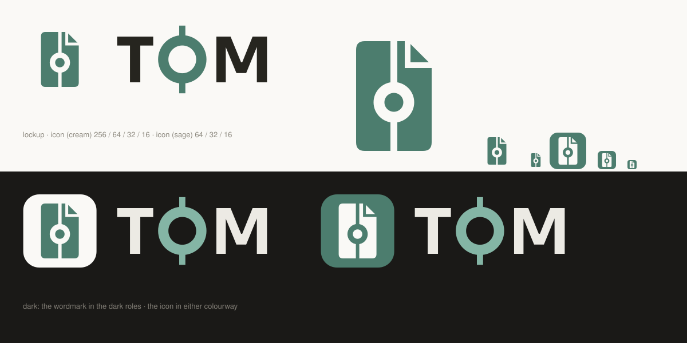

# Identity

What the product is called and what it wears on the dock.
[`visual-language/`](../visual-language/README.md) decides what the app looks
like; this decides the marks.



| | |
|---|---|
| [`the-shape.md`](the-shape.md) | One shape, twice: the commit on the trunk |
| [`icon.md`](icon.md) | The tile, the two colourways, the grid |
| [`wordmark.md`](wordmark.md) | `TOM`, and why the O is not the font's |
| [`lockup.md`](lockup.md) | Icon and wordmark together |
| [`rules.md`](rules.md) | The six rules every use is held to |
| [`files.md`](files.md) | What is generated, what is committed, what each runner needs |

**Everything here is generated** by [`tools/brand.py`](../tools/brand.py), which
is also where the shapes are decided:

```bash
python3 docs/design/tools/brand.py                 # the SVG masters and this sheet
python3 docs/design/tools/brand.py --rasters DIR   # + PNG 16–1024, .icns and .ico
```

---

*See also: [design/](../README.md) · [visual-language/](../visual-language/README.md) · [site/](../site/README.md)*
