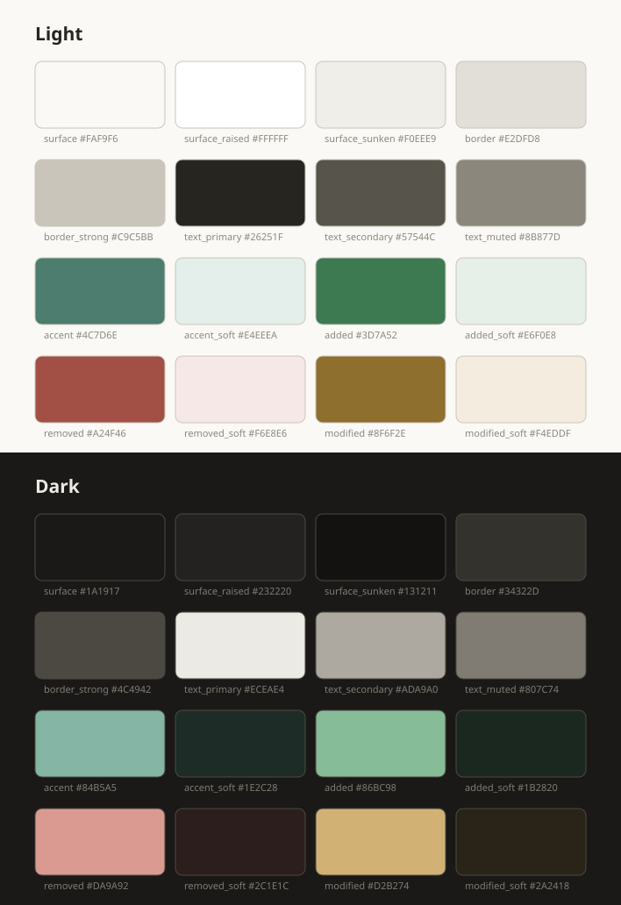

# Visual language

The colour system for the app. Wireframes deliberately carry none of it ([README](README.md)) — they answer *what is on the screen*, and this answers *what it looks like*.



Values live in [`tools/palette.py`](tools/palette.py), which is also what generates the sheet above and checks every pairing:

```bash
python3 docs/design/tools/palette.py
```

## Roles, never shades

Nothing here is called `grey200`. A role survives a palette change; a shade number does not, and renaming it later means touching every widget that used it.

| Role | Light | Dark | Used for |
|---|---|---|---|
| `surface` | `#FAF9F6` | `#1A1917` | The page |
| `surface_raised` | `#FFFFFF` | `#232220` | Panels, popovers, cards |
| `surface_sunken` | `#F0EEE9` | `#131211` | Inputs, code blocks, the inactive pane |
| `border` | `#E2DFD8` | `#34322D` | Dividers between regions |
| `border_strong` | `#C9C5BB` | `#4C4942` | Control outlines, focus |
| `text_primary` | `#26251F` | `#ECEAE4` | Body and headings |
| `text_secondary` | `#57544C` | `#ADA9A0` | Metadata, secondary labels |
| `text_muted` | `#8B877D` | `#807C74` | Captions, placeholders |
| `accent` | `#4C7D6E` | `#84B5A5` | Selection, active state, links |
| `accent_soft` | `#E4EEEA` | `#1E2C28` | The fill behind an active row |
| `added` / `added_soft` | `#3D7A52` / `#E6F0E8` | `#86BC98` / `#1B2820` | Diff: a block that appeared |
| `removed` / `removed_soft` | `#A24F46` / `#F6E8E6` | `#DA9A92` / `#2C1E1C` | Diff: a block that went |
| `modified` / `modified_soft` | `#8F6F2E` / `#F4EDDF` | `#D2B274` / `#2A2418` | Diff: a block that changed |

## Why these

**Warm neutrals, not blue-grey.** Every surface carries a little yellow, so a long document does not glare the way a pure white page does, and dark mode does not read as cold slate. The two modes share a temperature, which is what makes switching feel like the same product at a different time of day.

**Sage as the accent, not blue.** The default accent in every framework is a saturated blue, and it makes a documentation tool look like a dashboard. A muted green sits back and lets the text lead, which is the whole point of an app whose content is prose.

**No pure black and no pure white.** `text_primary` is `#26251F`, not `#000`. Pure black on white is the highest-contrast and least comfortable pairing there is for continuous reading.

**Muted diff colours.** The rendered diff is the product's differentiator, so it appears on screen constantly rather than occasionally. Saturated red and green would exhaust a reader within one document; these are desaturated to the point where a whole page of changes still reads as a document rather than a warning.

## Rules

1. **Colour is never the only signal.** A diff block carries a gutter mark and a position, not just a tint — roughly one in twelve men cannot separate the red from the green. The same holds for status anywhere else in the app.
2. **Both modes ship together.** A colour added in one mode without its counterpart is a bug, not a follow-up. `palette.py` fails loudly if a role is missing from either map.
3. **Contrast is verified, not eyeballed.** Every pairing the UI actually produces is checked against WCAG AA — 4.5:1 for body text, 3:1 for large text and non-text marks. All sixteen pass today; adding a role means adding its pairing to `PAIRS`.
4. **The accent does not carry meaning on its own.** It marks *the current thing*: the open document, the checked-out branch, the focused control. Anything semantic — added, removed, modified — uses the diff roles.
5. **`surface_raised` means "above".** Popovers and panels use it in light mode and get *lighter* in dark mode, because elevation reads as proximity to the light source in both.

## What is deliberately not decided here

Type and spacing. The wireframes fix a working rhythm ([the kit](tools/kit.py)) but that is drawing scale, not product typography — the reading column width, the heading scale for rendered markdown and the line height for long prose are decided against real rendered documents, not against boxes. That happens when the preview renders for the first time, in M0.
